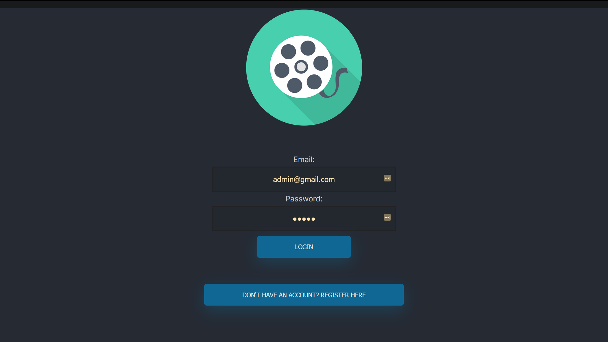
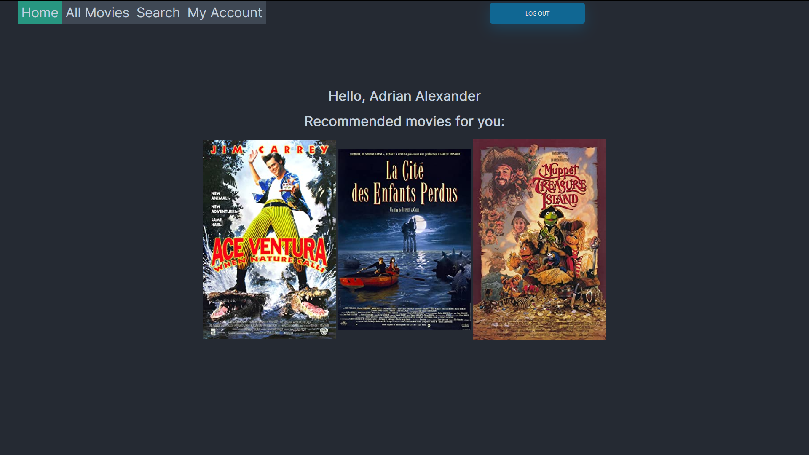
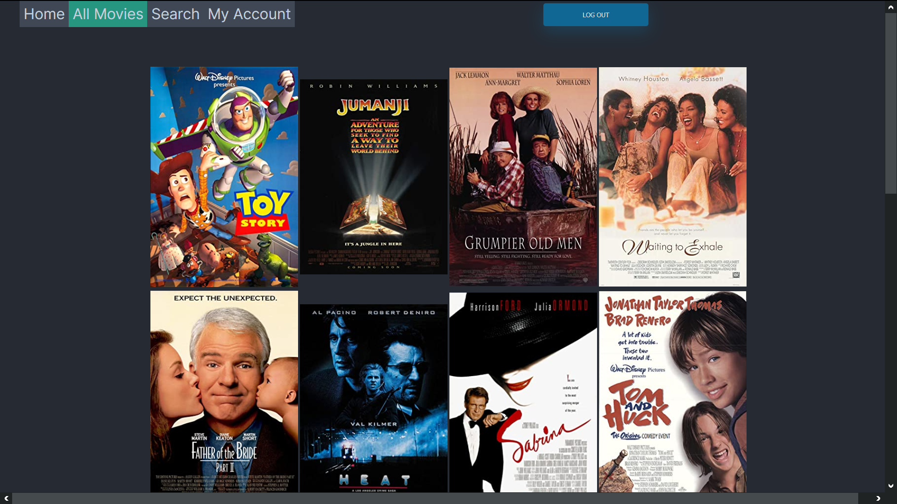
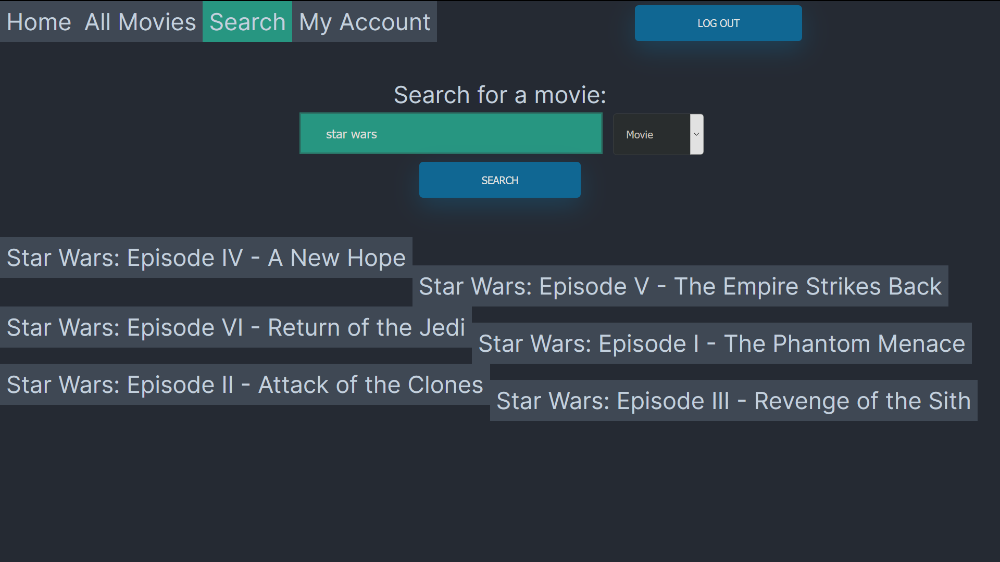

Project: Movie Database
Made by: Adrian Alexander
Date: December 7, 2020

Features:
 - Has public API that returns movie JSON data
 - Registration and login functionality - credentials are saved in JSON file
 - Recommended movies are based off favourite movie's genres
 - Movie list is based off given JSON file, and is separated by pages, and can adjust rows and # of movies on a page
 - Search based on movie name, genre, director, actor, or writer, returns movie based on search result
 - Movie page includes links to people involved, and allows to add movie to favourites
 - Person page allows to follow person
 - User page displays favorite movies, people following and users following
 - User page has button to upgrade to 'Contributing User' to allow the ability to leave movie reviews and add movies

